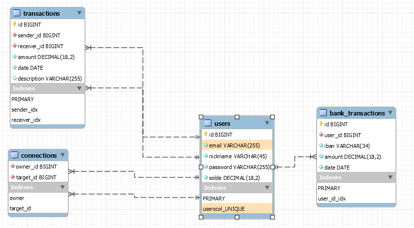

# payMyBuddy
 Openclassroom DA JAVA P6

#Installation
1. Cloner le repo
2. Installer Mysql
3. Exécuter le script contenu dans script.sql
4. Créer un nouvel utilisateur et lui donner les droits sur les databases paymybuddy et paymybuddytest

#Modèle Physique de Données

